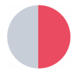
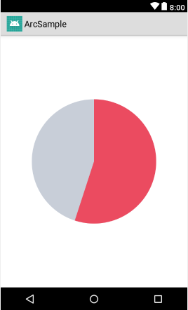

## Android円弧描画サンプル

### 概要

職場の期待の新人が、パーセンテージの円グラフを描画するのにMPAndroidChartにはドーナツ型しかないよぉぉぉと絶望の淵に立たされていた。  
こういうやつ。



上の例だと50%ですね。

で、君は円弧すら自前で描画できないフレンズなんだね！　って優しく指導したのですがさらに絶望の穴に飛び込みそうになったので、パワハラで訴えられる前に書いたサンプルがこれです。

### 仕組み

ProgressBarのDrawableとして、単純に背景と描画部分をxmlのshapeで記述しているだけです。

```xml
<layer-list
        xmlns:android="http://schemas.android.com/apk/res/android">
    <item android:id="@android:id/background">
        <shape
                android:shape="ring"
                android:innerRadius="0dp"
                android:thickness="128dp"
                android:useLevel="false">
            <solid
                    android:color="#c8ced8"/>
        </shape>
    </item>
    <item android:id="@android:id/progress">
        <shape
                android:shape="ring"
                android:innerRadius="0dp"
                android:thickness="128dp"
                android:useLevel="true">
            <solid
                    android:color="#eb4b60"/>
        </shape>
    </item>
</layer-list>
```

id="@android:id/background"に指定するのが背景、id="@android:id/progress"に指定するのが進捗部分です。


innerRadiusを0dpにすると円になります。ここに値を入れると円環になっちゃう。何かが穢れた時に導かれちゃう。  
thicknessで円の大きさを指定します。  
solidの中のcolorで色を指定するのは言うまでも無い。

ProgressBarを設置しているレイアウトはこちら。

```xml
<?xml version="1.0" encoding="utf-8"?>
<LinearLayout
        xmlns:android="http://schemas.android.com/apk/res/android"
        xmlns:tools="http://schemas.android.com/tools"
        android:orientation="vertical"
        android:layout_width="match_parent"
        android:layout_height="match_parent">
    <ProgressBar
            style="?android:attr/progressBarStyle"
            android:layout_width="match_parent"
            android:layout_height="match_parent"
            android:id="@+id/progressBar"
            android:indeterminateOnly="false"
            android:rotation="-90"
            android:progressDrawable="@drawable/arc_progress"
            android:progress="60"
            android:max="100" tools:layout_editor_absoluteX="256dp"/>
</LinearLayout>
```

progressに0-100を入れればパーセンテージでの円グラフのできあがり。  
rotationを-90とする事によって、0時の位置から描画させるようにしています。  
indeterminateOnlyはfalseにしないとDrawableがいい感じに適用されません。

実行結果がこちら。



上は60を入れた時、つまり60%を表しています。
